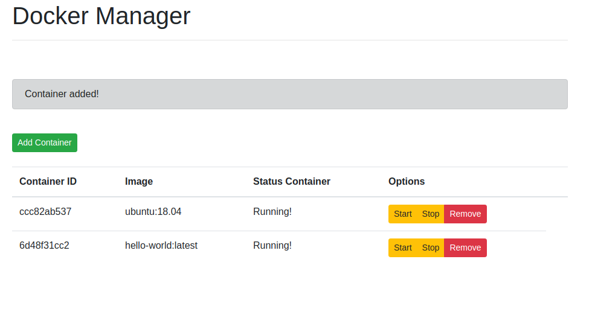

# Stone Python Developer Challenge


1. Run the server-side Flask app in one terminal window:

    ```sh
    $ cd server
    $ python3.7 -m venv env
    $ source env/bin/activate
    (env)$ pip install -r requirements.txt
    (env)$ python3 app.py
    ```

    Navigate to [http://localhost:5000](http://localhost:5000)

1. Run the client-side Vue app in a different terminal window:

    ```sh
    $ cd client
    $ npm install
    $ npm run serve
    ```

    Navigate to [http://localhost:8080](http://localhost:8080)
    
 *The most importants files of project are:*
 
client: stone_exercise/client/src/components/Containers.vue <br>
server: stone_exercise/server/app.py


